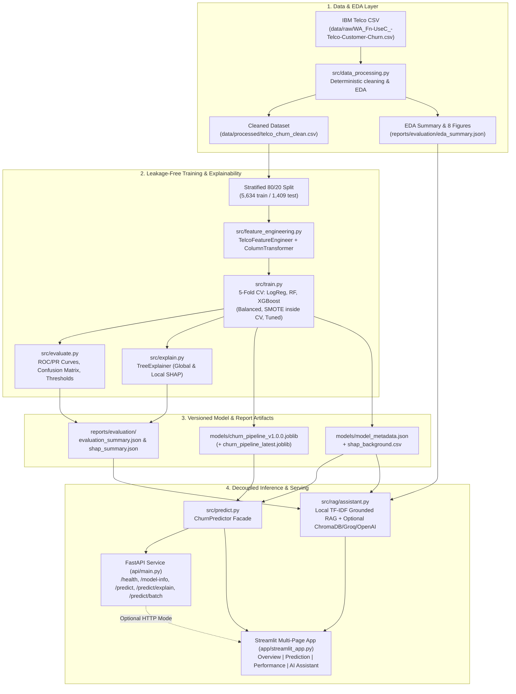
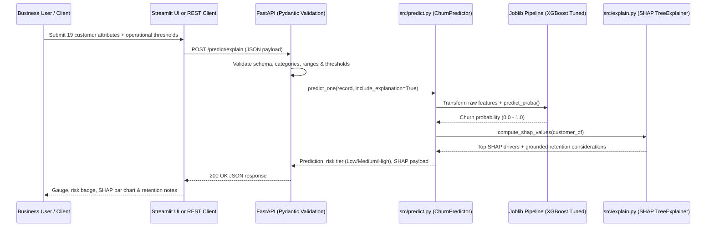

# System Architecture Diagram — Customer Churn Prediction System

## End-to-End ML, Explainability, API, Frontend & Optional RAG Flow

```mermaid
flowchart TB
    subgraph DataLayer["1. Data & EDA Layer"]
        Raw["IBM Telco CSV<br/>(data/raw/WA_Fn-UseC_-Telco-Customer-Churn.csv)"]
        Clean["src/data_processing.py<br/>Deterministic cleaning & EDA"]
        Processed["Cleaned Dataset<br/>(data/processed/telco_churn_clean.csv)"]
        EDAArt["EDA Summary & 8 Figures<br/>(reports/evaluation/eda_summary.json)"]
        Raw --> Clean --> Processed
        Clean --> EDAArt
    end

    subgraph TrainingLayer["2. Leakage-Free Training & Explainability"]
        Split["Stratified 80/20 Split<br/>(5,634 train / 1,409 test)"]
        FE["src/feature_engineering.py<br/>TelcoFeatureEngineer + ColumnTransformer"]
        Train["src/train.py<br/>5-Fold CV: LogReg, RF, XGBoost<br/>(Balanced, SMOTE inside CV, Tuned)"]
        Eval["src/evaluate.py<br/>ROC/PR Curves, Confusion Matrix, Thresholds"]
        SHAP["src/explain.py<br/>TreeExplainer (Global & Local SHAP)"]
        Processed --> Split --> FE --> Train
        Train --> Eval
        Train --> SHAP
    end

    subgraph ArtifactRegistry["3. Versioned Model & Report Artifacts"]
        Pipe["models/churn_pipeline_v1.0.0.joblib<br/>(+ churn_pipeline_latest.joblib)"]
        Meta["models/model_metadata.json<br/>+ shap_background.csv"]
        EvalJSON["reports/evaluation/<br/>evaluation_summary.json & shap_summary.json"]
        Train --> Pipe
        Train --> Meta
        Eval --> EvalJSON
        SHAP --> EvalJSON
    end

    subgraph ServingLayer["4. Decoupled Inference & Serving"]
        Predict["src/predict.py<br/>ChurnPredictor Facade"]
        API["FastAPI Service (api/main.py)<br/>/health, /model-info, /predict, /predict/explain, /predict/batch"]
        RAG["src/rag/assistant.py<br/>Local TF-IDF Grounded RAG + Optional ChromaDB/Groq/OpenAI"]
        UI["Streamlit Multi-Page App (app/streamlit_app.py)<br/>Overview | Prediction | Performance | AI Assistant"]

        Pipe --> Predict
        Meta --> Predict
        Predict --> API
        Predict --> UI
        API -. "Optional HTTP Mode" .-> UI
        EDAArt --> RAG
        EvalJSON --> RAG
        Meta --> RAG
        RAG --> UI
    end
```

## Real-Time Customer Prediction Sequence

```mermaid
sequenceDiagram
    participant User as Business User / Client
    participant UI as Streamlit UI or REST Client
    participant API as FastAPI (Pydantic Validation)
    participant Pred as src/predict.py (ChurnPredictor)
    participant Pipe as Joblib Pipeline (XGBoost Tuned)
    participant Exp as src/explain.py (SHAP TreeExplainer)

    User->>UI: Submit 19 customer attributes + operational thresholds
    UI->>API: POST /predict/explain (JSON payload)
    API->>API: Validate schema, categories, ranges & thresholds
    API->>Pred: predict_one(record, include_explanation=True)
    Pred->>Pipe: Transform raw features + predict_proba()
    Pipe-->>Pred: Churn probability (0.0 - 1.0)
    Pred->>Exp: compute_shap_values(customer_df)
    Exp-->>Pred: Top SHAP drivers + grounded retention considerations
    Pred-->>API: Prediction, risk tier (Low/Medium/High), SHAP payload
    API-->>UI: 200 OK JSON response
    UI-->>User: Gauge, risk badge, SHAP bar chart & retention notes
```
